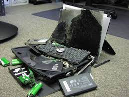
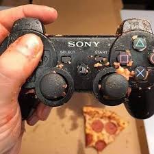

Robot Packing List
==================

Before going to a demo or competition, you'll save yourself a lot of headache if you know what to bring!

NOTE: This section only covers the minimum  
required tools for the ROBOT, you'll still  
need to pack more such as safty gear, first  
aid and resources/banners.

Packing List
------------

.. list-table:: Unnamed Toaster Demo Packing List
   :widths: 16 35 38 6
   :header-rows: 1

   * - Item
     - Desc
     - image
     - Check
   * - Unnamed Toaster
     - The biggest thing you'll have to worry about packing.
     - 
     - 
   * - Drive Laptop
     - Used to run the driver station software required for the robot. All the robotics laptops can do this, just make sure to boot into windows when prompted.
     - |drive_laptop_photo|
     - 
   * - Driver Joystick
     - The driver joystick is larger than the operator joystick, and has only a single actual stick.
     - 
     - 
   * - Operator Joystick
     - The operator joystick is smaller, and has two smaller thumb sticks plus extra buttons.
     - |operator_joystick_photo|
     - 

